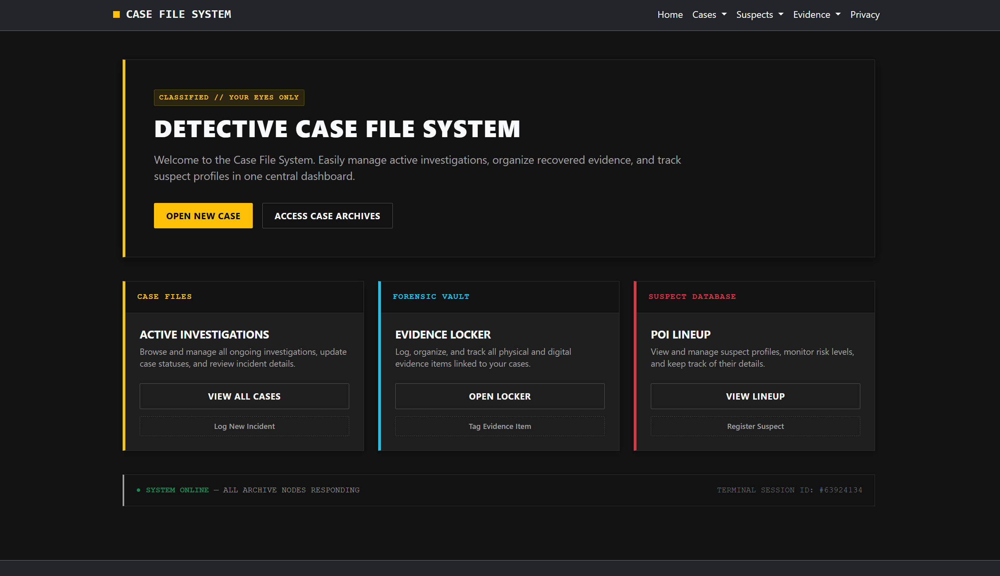

# Detective Case File System

## Overview
The Detective Case File System is a robust ASP.NET Core MVC application designed to manage forensic data, including active cases, suspects, and logged evidence. Built with a highly thematic, dark-mode "Forensic Vault" UI, it provides a realistic, immersive interface to execute full CRUD (Create, Read, Update, Delete) operations while maintaining strict data relationships and chain-of-custody integrity.

## Academic Context
* **Course:** Introduction to LINQ and ASP.NET MVC (SD-115-W26P)
* **Institution:** Manitoba Institute of Trades and Technology (MITT)
* **Developer:** Oghenefejiro Stephanie Abere

## Key Features
* **Complete CRUD Functionality:** Seamlessly add, view, edit, and safely delete records across Cases, Suspects, and Evidence.
* **Dynamic Cascading Data:** Built-in JavaScript event listeners ensure that when logging evidence, the "Suspect" dropdown dynamically filters to only show individuals linked to the currently selected Case.
* **Intelligent Data Relationships:** Supports realistic investigative workflows where evidence can be logged independently and assigned to suspects at a later date.
* **Thematic UI/UX:** Features a custom dark-mode aesthetic with specialized CSS styling for different threat levels (e.g., dedicated visual warnings for `ArmedAndDangerous` or `Extreme` risks).
* **Automated Placeholders:** Integrates dynamic `placehold.co` image generation formatted to match the dark terminal aesthetic for evidence files lacking visual data.
* **MVC Best Practices:** Follows strict separation of concerns utilizing Models, Views, Controllers, ViewModels, and `ViewBag` data passing.

## Technologies Used
* **Backend:** C#, ASP.NET Core 8.0 (MVC pattern)
* **Frontend:** HTML5, CSS3, JavaScript, Bootstrap 5
* **Data Management:** LINQ, In-Memory Data Collections (for demonstration purposes)

## Installation & Setup Instructions
1. Extract the project folder.
2. Open the solution (`.sln`) file in **Visual Studio**.
3. Rebuild the solution by navigating to `Build > Rebuild Solution` in the top menu to restore any necessary NuGet packages.
4. Press the **Start** button to run the application in your default web browser.

## Application Structure
* `/Controllers` - Contains the routing and business logic (Case, Suspect, Evidence, Home).
* `/Models` - Contains the C# class definitions, enums (e.g., `RiskLevel`), and data relationships.
* `/Views` - Contains the Razor syntax (`.cshtml`) pages, organized by controller, featuring custom form layouts and thematic design elements.
* `/wwwroot` - Contains all static assets, including site-wide CSS, JavaScript files, and the application favicon.